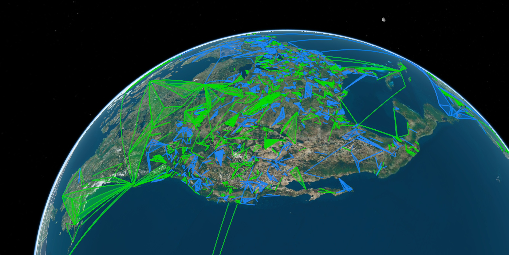

# IITC Next

This project is a Total Conversion for Ingress Intel that adds a 3D globe view using CesiumJS.

## Features

* A 3D Globe view of the Earth.
* Integration with Google Earth's 3D tiles.
* Lightweight userscript powered by Vite and Cesium CDN.
* Custom user plugins for various features of IITC Next.

## Installation

### For browsers

Note: You need to diable every IITC-CE userscript/plugin when using
IITC-Next. IITC-Next is not a plugin of IITC-CE and it does not work with it.

1. Download the userscript from [Releases](https://github.com/homanw104/iitc-next/releases).
   The userscript is named like `iitc-next-v2.2.1.js`.
2. Install [Tampermonkey](https://chromewebstore.google.com/detail/tampermonkey/dhdgffkkebhmkfjojejmpbldmpobfkfo)
   in your browser, a userscript executor.
3. Open Tampermonkey, inside the Dashboard, go to the Utility page.
4. Choose "Import from file" and select the downloaded userscript.
5. Install the userscript in Tampermonkey.
6. Open <https://intel.ingress.com/>
7. Enjoy.

### For Android

Download the apk from [Releases](https://github.com/homanw104/iitc-next/releases),
or request for closed test access on Google Play by joining the [Telegram group](https://t.me/iitc_next_closed_test).

## Development

1. `npm install`: Installs all necessary dependencies.
2. `npm run dev`: Starts the live-update server.

## Build Userscript

1. `npm run build`: Generates the final .user.js file in the `dist/` folder.
2. `npm run build:plugin`: Generates plugin .js files in the `dist/plugins` folder,
   though official plugins are alreadly bundled in `initPlugins.ts`.

## Build for Android

1. `npm run cap:sync`: Syncs the dist folder to the Android project.
2. `npm run cap:open:android`: Opens the project in Android Studio.
3. Build the project in Android Studio.
   1. Once Android Studio loads, wait for Gradle to finish syncing.
   2. Go to Build > Build Bundle(s) / APK(s) > Build APK(s).
   3. The generated APK will be located at: `android/app/build/outputs/apk/debug/app-debug.apk`
4. Alternatively, you can build directly from the terminal if you have the `ANDROID_HOME` environment variable set.
   1. Run `./gradlew assembleDebug` from the `android` directory.
   2. The generated APK will be located at: `android/app/build/outputs/apk/debug/app-debug.apk`
